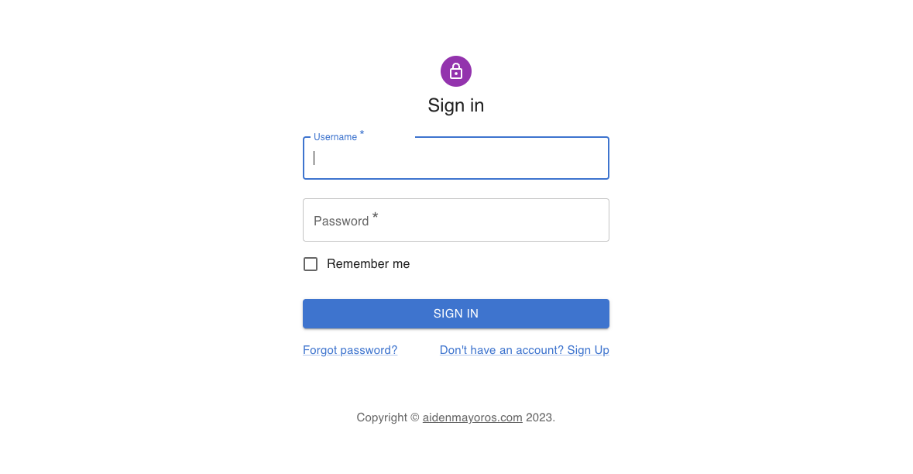
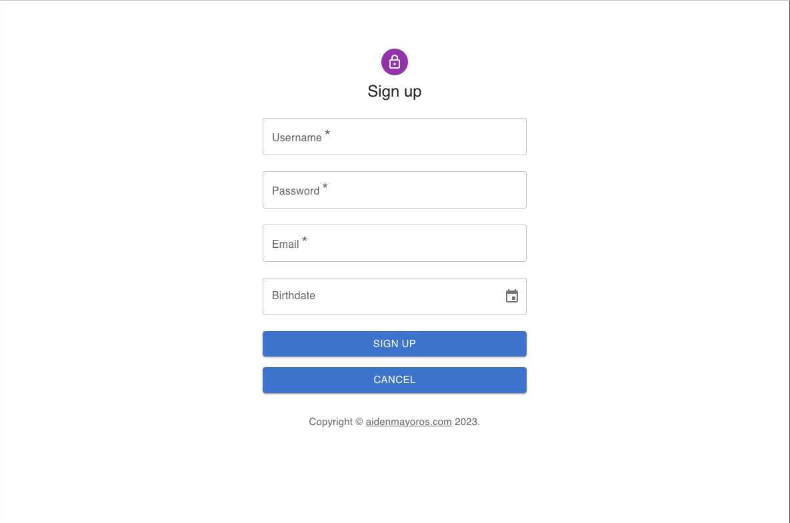
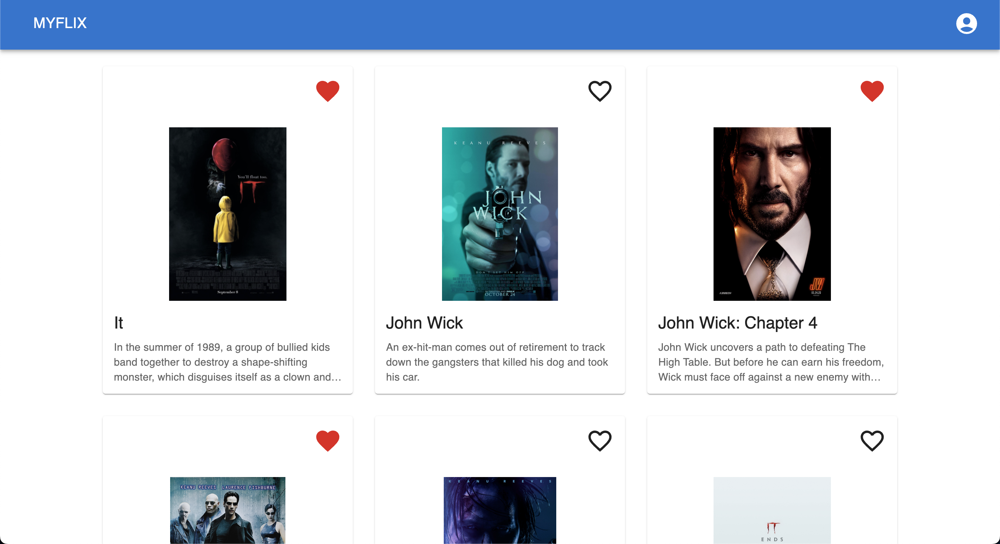
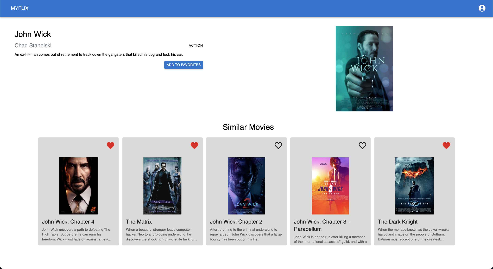
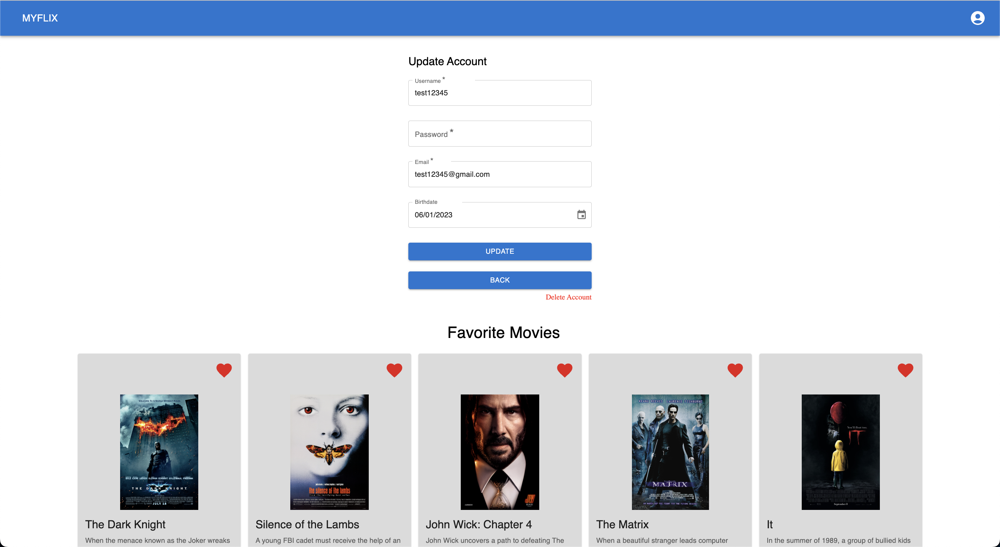

# myFlix-client

Front end built with [React framework](https://react.dev/) and utalizing [Material UI](https://mui.com/) library for styling and functionality.

App is built for learning React and libraries directed by the [Career Foundry](https://careerfoundry.com/) Coding Bootcamp.

App shows CRUD functionality with Mongo Database. Users are able to sign up, login, view movies, add movies to favorite list, remove movies from favorites, view profile info, update profile information, and delete profile.

## Build Process

Build process is utalizing Parcel. To create build run parcel [Path to index.html]
Example: from project directory run - parcel src/index.html

